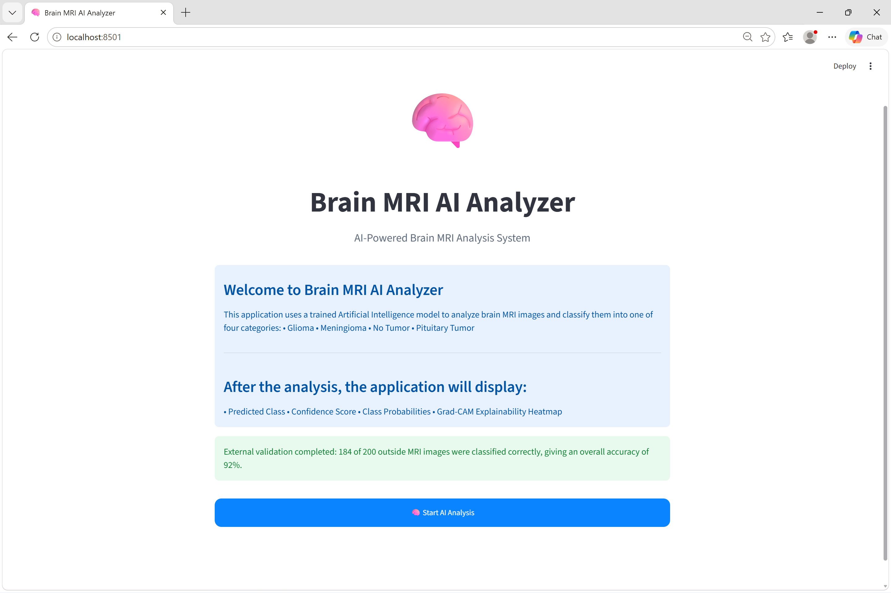
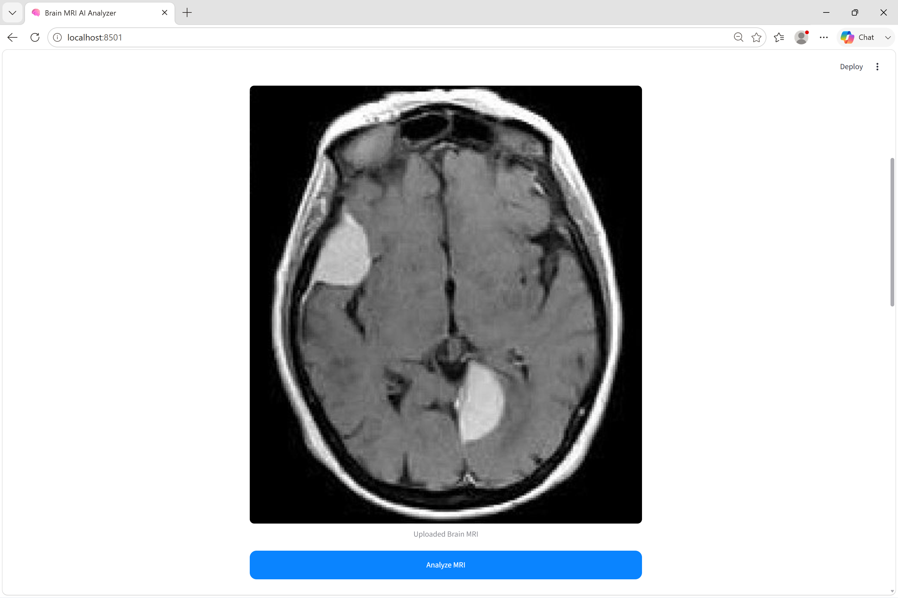
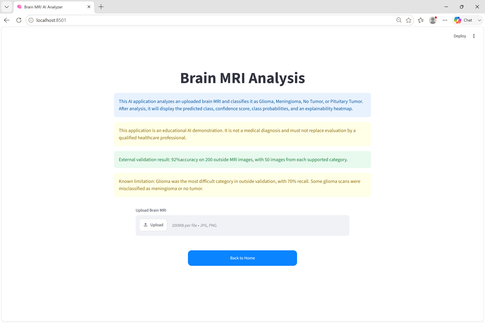
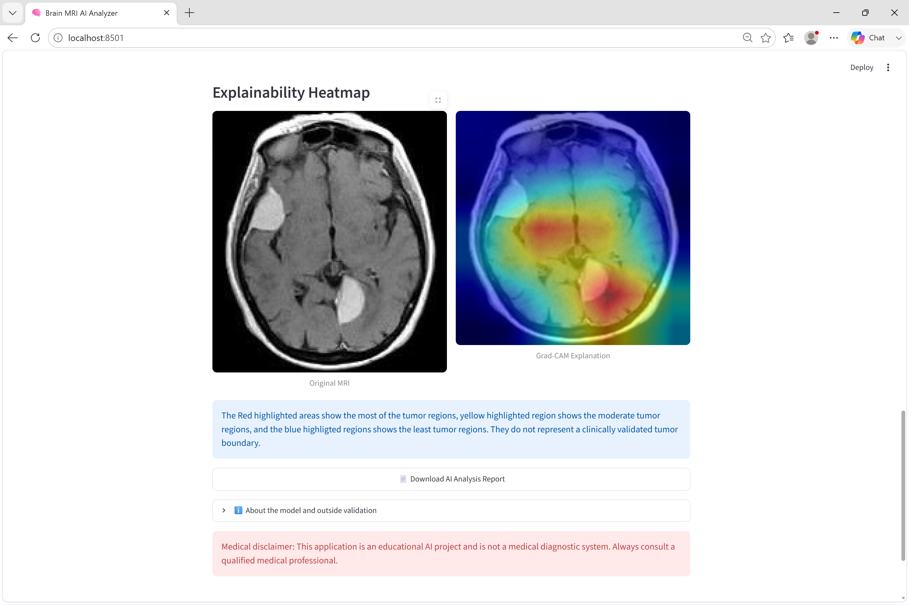
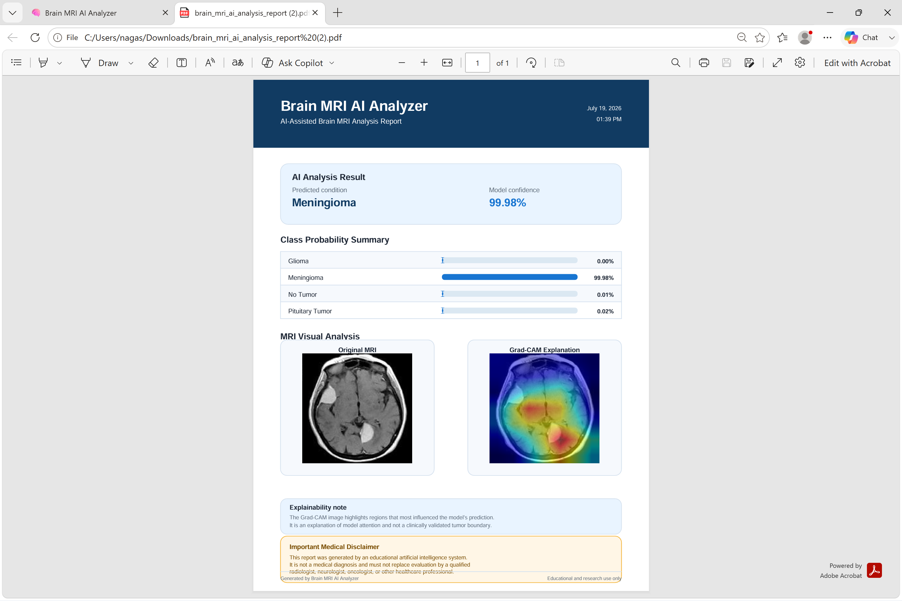

# Brain MRI AI Analyzer

An AI-powered web application that analyzes brain MRI images using Deep Learning and classifies them into four categories:

- Glioma
- Meningioma
- No Tumor
- Pituitary Tumor

The application uses a fine-tuned ResNet18 convolutional neural network for classification and provides Grad-CAM visual explanations to improve model interpretability. It also generates a downloadable PDF report containing the prediction results, confidence scores, class probabilities, and explainability heatmap.

The project includes external validation on unseen MRI images to evaluate the model's generalization performance.

---

# Features

- Brain MRI classification using a fine-tuned ResNet18 deep learning model
- Supports four brain MRI classes:
  - Glioma
  - Meningioma
  - No Tumor
  - Pituitary Tumor
- Displays prediction confidence scores
- Shows class probability distribution
- Grad-CAM explainability heatmap for model interpretation
- Generates a downloadable AI analysis PDF report
- Interactive Streamlit web application
- Comprehensive evaluation using:
  - Accuracy
  - Precision
  - Recall
  - F1-score
  - Confusion Matrix
  - Classification Report
- External validation on unseen MRI images

---

# Technologies Used

| Category | Technologies |
|----------|--------------|
| Programming Language | Python |
| Deep Learning | PyTorch, TorchVision |
| Model | ResNet18 (Transfer Learning) |
| Web Application | Streamlit |
| Explainability | Grad-CAM |
| Image Processing | Pillow, OpenCV |
| Data Analysis | NumPy, Pandas |
| Visualization | Matplotlib |
| Machine Learning Metrics | Scikit-learn |
| PDF Report Generation | ReportLab |
| Development Environment | VS Code, Jupyter Notebook |

---

# Project Structure

```text
Brain-MRI-AI-Analyzer/
│
├── app/                     # Streamlit application
├── data/                    # MRI datasets
├── models/                  # Trained ResNet18 model
├── notebooks/               # Development notebooks
├── results/                 # Evaluation reports and confusion matrices
├── src/                     # Reusable Python modules
├── requirements.txt
├── README.md
└── .gitignore
```

---

# Model Performance

The model was evaluated using both the original testing dataset and an independent external validation dataset.

## Original Test Evaluation

The following evaluation metrics were computed:

- Accuracy
- Precision
- Recall
- F1-Score
- Confusion Matrix
- Classification Report

## External Validation

To evaluate the model's ability to generalize, an additional external validation dataset containing **200 unseen brain MRI images** was used.

| Metric | Value |
|---------|-------|
| Total Images | 200 |
| Correct Predictions | 184 |
| Incorrect Predictions | 16 |
| Overall Accuracy | **92%** |

### Class-wise Recall

| Class | Recall |
|--------|--------|
| Glioma | 70% |
| Meningioma | 98% |
| No Tumor | 100% |
| Pituitary Tumor | 100% |

The external validation images were **not used during training**, providing an additional assessment of the model's generalization performance.

---

# Explainable AI

To improve transparency, the application uses **Grad-CAM (Gradient-weighted Class Activation Mapping)**.

Grad-CAM highlights the image regions that contributed most to the model's prediction, helping users better understand how the AI reached its decision.

> **Note:** The Grad-CAM visualization illustrates model attention and should not be interpreted as an exact tumor boundary or a medical segmentation.

---

# AI Analysis Report

After completing the analysis, the application automatically generates a downloadable PDF report containing:

- Predicted brain MRI class
- Model confidence score
- Class probability distribution
- Original MRI image
- Grad-CAM explainability heatmap
- AI interpretation notes
- Medical disclaimer

This report can be downloaded directly from the Streamlit application.

---

# Installation

## Clone the repository

```bash
git clone https://github.com/your-username/Brain-MRI-AI-Analyzer.git
cd Brain-MRI-AI-Analyzer
```

## Create a virtual environment

### Windows

```bash
python -m venv venv
venv\Scripts\activate
```

### macOS/Linux

```bash
python3 -m venv venv
source venv/bin/activate
```

## Install dependencies

```bash
pip install -r requirements.txt
```

---

# Running the Application

Start the Streamlit application:

```bash
streamlit run app/app.py
```

Once the application launches, open the local URL displayed in the terminal (typically `http://localhost:8501`) in your web browser.

---

# Application Screenshots

## Home Page



---

## Upload MRI Image



---

## Prediction Result



---

## Analysis Report with Grad-CAM



---

## Downloadable PDF Report



---

# Future Improvements

Potential enhancements for future versions include:

- Support for additional brain tumor types
- Integration with cloud deployment platforms
- Improved model accuracy using larger datasets
- Multi-language user interface
- Automatic patient history integration
- Enhanced explainability techniques
- Mobile-friendly interface

---

# Medical Disclaimer

This application is intended for educational and research purposes only.

The predictions generated by the AI model should **not** be considered a substitute for professional medical diagnosis or clinical decision-making. Always consult qualified healthcare professionals for medical evaluation and treatment.

---
# 🧠 Brain MRI AI Analyzer

[🚀 Open Live App](https://brain-mri-ai-analyzer.streamlit.app)

# Author

**Naga Sanjana Maddula**

Artificial Intelligence Graduate | Biotechnology (Genetic Engineering)

Interested in:
- Artificial Intelligence
- Healthcare AI
- Medical Image Analysis
- Biomedical Engineering
- Explainable AI (XAI)

Feel free to connect with me on LinkedIn once the project is published.